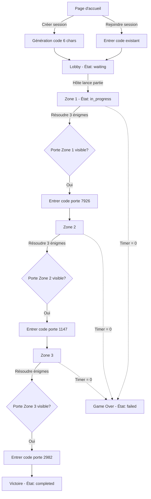
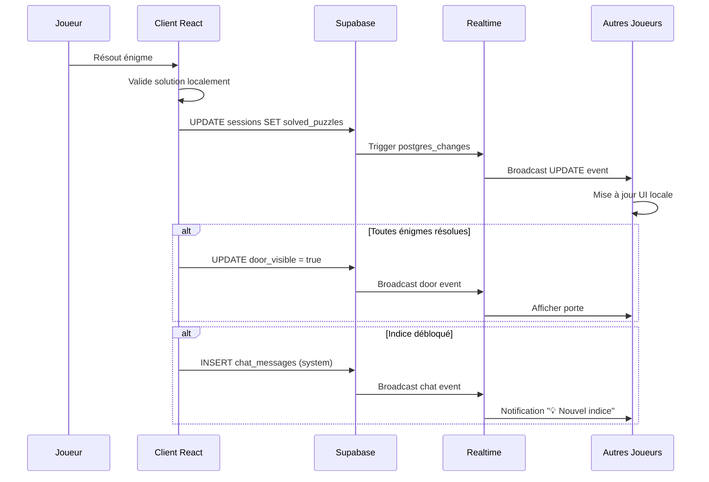

# 📚 Documentation Technique - Protocol Z : Le Dernier Vaccin

## 🎯 Vue d'ensemble

**Protocol Z** est un escape game multijoueur en temps réel développé avec React et Supabase. Les joueurs collaborent pour résoudre des énigmes scientifiques dans un laboratoire virtuel, avec synchronisation en temps réel de l'état du jeu.

---

## 🏗️ Architecture Technique

### Stack Technologique

| Technologie | Version | Rôle |
|------------|---------|------|
| **React** | 18.3.1 | Framework UI |
| **TypeScript** | 5.x | Typage statique |
| **Vite** | 5.x | Build tool & dev server |
| **Tailwind CSS** | 3.x | Styling & design system |
| **shadcn/ui** | - | Composants UI (Radix UI) |
| **Supabase** | 2.58.0 | Backend (BDD + Realtime) |
| **PostgreSQL** | - | Base de données relationnelle |
| **Zustand** | 5.0.8 | State management (inventaire) |
| **React Router DOM** | 6.30.1 | Navigation |

### Schéma de Base de Données

```sql
-- Table principale : sessions de jeu
CREATE TABLE sessions (
  code TEXT PRIMARY KEY,                    -- Code unique 6 caractères (ex: "ABC123")
  host_id UUID NOT NULL,                    -- ID du joueur hôte
  current_zone INTEGER DEFAULT 1,           -- Zone actuelle (1, 2, 3)
  timer_remaining INTEGER DEFAULT 3600,     -- Temps restant en secondes
  timer_running BOOLEAN DEFAULT false,      -- État du timer
  inventory JSONB DEFAULT '[]',             -- Inventaire partagé
  solved_puzzles JSONB DEFAULT '{}',        -- Énigmes résolues {"puzzle_id": true}
  revealed_hints JSONB DEFAULT '{"zone1": [], "zone2": [], "zone3": []}',
  door_visible JSONB DEFAULT '{"zone1": false, "zone2": false, "zone3": false}',
  door_codes JSONB DEFAULT '{}',            -- Codes de porte fixes
  door_status JSONB DEFAULT '{"zone1": "locked", "zone2": "locked", "zone3": "locked"}',
  status session_status DEFAULT 'waiting',  -- waiting | in_progress | completed | failed
  is_preloading BOOLEAN DEFAULT false,
  created_at TIMESTAMPTZ DEFAULT now(),
  updated_at TIMESTAMPTZ DEFAULT now()
);

-- Table des joueurs
CREATE TABLE players (
  id UUID PRIMARY KEY DEFAULT gen_random_uuid(),
  session_code TEXT NOT NULL,               -- Référence à sessions.code
  pseudo TEXT NOT NULL,                     -- Nom du joueur
  is_host BOOLEAN DEFAULT false,            -- Est-ce l'hôte ?
  is_connected BOOLEAN DEFAULT true,        -- État de connexion
  last_seen TIMESTAMPTZ DEFAULT now(),      -- Dernier heartbeat
  joined_at TIMESTAMPTZ DEFAULT now()
);

-- Table des messages de chat
CREATE TABLE chat_messages (
  id UUID PRIMARY KEY DEFAULT gen_random_uuid(),
  session_code TEXT NOT NULL,
  player_pseudo TEXT NOT NULL,
  message TEXT NOT NULL,
  type TEXT DEFAULT 'chat',                 -- 'chat' | 'system'
  metadata JSONB DEFAULT '{}',
  created_at TIMESTAMPTZ DEFAULT now()
);
```

### Synchronisation Realtime avec Supabase

Le jeu utilise **Supabase Realtime** pour synchroniser l'état entre tous les joueurs :

```typescript
// Hook personnalisé : useRealtimeSync.ts
const channel = supabase.channel(`session:${sessionCode}`);

// Écoute des changements sur la session
channel.on('postgres_changes', {
  event: 'UPDATE',
  schema: 'public',
  table: 'sessions',
  filter: `code=eq.${sessionCode}`
}, (payload) => {
  // Mise à jour locale de l'état
  callbacks.onSessionUpdate(payload.new);
});

// Écoute des nouveaux joueurs
channel.on('postgres_changes', {
  event: 'INSERT',
  schema: 'public',
  table: 'players',
  filter: `session_code=eq.${sessionCode}`
}, (payload) => {
  callbacks.onPlayerJoin(payload.new);
});

// Écoute des messages de chat
channel.on('postgres_changes', {
  event: 'INSERT',
  schema: 'public',
  table: 'chat_messages',
  filter: `session_code=eq.${sessionCode}`
}, (payload) => {
  callbacks.onChatMessage(payload.new);
});
```

**Avantages :**
- ✅ Synchronisation instantanée (<100ms de latence)
- ✅ Pas de polling côté client
- ✅ Gestion automatique de la reconnexion
- ✅ Scalabilité (jusqu'à 100 connexions simultanées par canal)

---

## 🎮 Systèmes de Jeu

### Flow de Jeu


```mermaid
graph TD
    A[Page d'accueil] -->|Créer session| B[Génération code 6 chars]
    A -->|Rejoindre session| C[Entrer code existant]
    B --> D[Lobby - État: waiting]
    C --> D
    D -->|Hôte lance partie| E[Zone 1 - État: in_progress]
    E -->|Résoudre 3 énigmes| F{Porte Zone 1 visible?}
    F -->|Oui| G[Entrer code porte 7926]
    G --> H[Zone 2]
    H -->|Résoudre 3 énigmes| I{Porte Zone 2 visible?}
    I -->|Oui| J[Entrer code porte 1147]
    J --> K[Zone 3]
    K -->|Résoudre énigmes| L{Porte Zone 3 visible?}
    L -->|Oui| M[Entrer code porte 2982]
    M --> N[Victoire - État: completed]
    E -.->|Timer = 0| O[Game Over - État: failed]
    H -.->|Timer = 0| O
    K -.->|Timer = 0| O
```

### Timer (Contrôlé par l'Hôte)

```typescript
// Hook personnalisé : useTimer.ts
const useTimer = (sessionCode, initialTime, isHost, onTimeEnd) => {
  const [timeRemaining, setTimeRemaining] = useState(initialTime);
  const [isRunning, setIsRunning] = useState(false);

  useEffect(() => {
    if (!isHost || !isRunning || timeRemaining <= 0) return;

    const interval = setInterval(() => {
      setTimeRemaining(prev => {
        const newTime = Math.max(0, prev - 1);
        
        // Sauvegarde en BDD toutes les 5 secondes
        if (newTime % 5 === 0) {
          supabase.from('sessions').update({ 
            timer_remaining: newTime 
          }).eq('code', sessionCode);
        }

        // Fin du jeu
        if (newTime === 0) {
          supabase.from('sessions').update({ 
            status: 'failed',
            timer_running: false
          }).eq('code', sessionCode);
          onTimeEnd?.();
        }

        return newTime;
      });
    }, 1000);

    return () => clearInterval(interval);
  }, [isHost, isRunning, timeRemaining]);

  return { timeRemaining, isRunning, toggleTimer, formatTime };
};
```

**Justification :** Le timer tourne uniquement côté hôte pour éviter les désynchronisations. Les autres joueurs reçoivent les mises à jour via Realtime.

### Inventaire Partagé

```typescript
// Hook personnalisé : useInventory.ts (Zustand)
interface InventoryState {
  items: InventoryItem[];
  addItem: (item: InventoryItem) => Promise<void>;
  removeItem: (itemId: string) => Promise<void>;
  hasItem: (itemId: string) => boolean;
}

const useInventory = create<InventoryState>((set, get) => ({
  items: [],
  
  addItem: async (item) => {
    const currentItems = get().items;
    if (currentItems.some(i => i.id === item.id)) return;
    
    const newItems = [...currentItems, item];
    set({ items: newItems });
    
    // Synchroniser avec Supabase
    await supabase.from('sessions').update({
      inventory: newItems
    }).eq('code', sessionCode);
  },
  
  hasItem: (itemId) => get().items.some(i => i.id === itemId)
}));
```

### Structure des Énigmes (`enigmes.json`)

```json
{
  "zones": {
    "zone1": {
      "name": "Laboratoire Principal",
      "description": "Première zone...",
      "puzzles": {
        "testtubes": {
          "id": "testtubes",
          "name": "Tubes à Essai",
          "description": "Organisez les tubes par température",
          "solution": "FROID",
          "hints": [
            "Les températures sont inscrites sur les tubes",
            "Triez du plus froid au plus chaud",
            "Prenez les premières lettres"
          ],
          "reward": {
            "type": "item",
            "item": {
              "id": "code_fragment_1",
              "name": "Fragment de code 1"
            }
          }
        }
      }
    }
  }
}
```

### Validation de Solution

```typescript
// lib/gameLogic.ts
export const validatePuzzleSolution = (puzzleId: string, userAnswer: string): boolean => {
  for (const zone of Object.values(enigmesData.zones)) {
    for (const puzzle of Object.values(zone.puzzles)) {
      if (puzzle.id === puzzleId) {
        const normalizedAnswer = userAnswer.trim().toUpperCase();
        const solutionValue = puzzle.solution || puzzle.code || puzzle.keyword;
        return normalizedAnswer === String(solutionValue).toUpperCase();
      }
    }
  }
  return false;
};
```

### Progression entre Zones

```typescript
// Hook personnalisé : usePuzzleSolver.ts
const solvePuzzle = async (puzzleId: string) => {
  // 1. Mettre à jour solved_puzzles
  const newSolvedPuzzles = { ...session.solved_puzzles, [puzzleId]: true };
  
  // 2. Révéler un indice automatiquement
  const hintMapping = { 'testtubes': 'p1', 'dna': 'p2', 'microscope': 'p3' };
  const hintKey = hintMapping[puzzleId];
  if (hintKey) {
    const newRevealedHints = {
      ...session.revealed_hints,
      [currentZone]: [...session.revealed_hints[currentZone], hintKey]
    };
  }
  
  // 3. Vérifier si toutes les énigmes de la zone sont résolues
  if (isZoneComplete(currentZone, newSolvedPuzzles)) {
    // Afficher la porte
    const newDoorVisible = { 
      ...session.door_visible, 
      [`zone${currentZone}`]: true 
    };
    
    toast.success('🎉 Toutes les énigmes résolues ! La porte est déverrouillée.');
  }
  
  // 4. Sauvegarder en BDD
  await supabase.from('sessions').update({
    solved_puzzles: newSolvedPuzzles,
    revealed_hints: newRevealedHints,
    door_visible: newDoorVisible
  }).eq('code', sessionCode);
};
```

---

## 🧩 Exemples d'Énigmes

### 1. Tubes à Essai (Zone 1)

**Principe :** Trier des tubes par température croissante, puis lire les initiales.

```typescript
// components/puzzles/TestTubes.tsx
const TUBES = [
  { id: 1, label: 'F', temp: -20, color: 'blue' },
  { id: 2, label: 'R', temp: 5, color: 'cyan' },
  { id: 3, label: 'O', temp: 25, color: 'yellow' },
  { id: 4, label: 'I', temp: 50, color: 'orange' },
  { id: 5, label: 'D', temp: 100, color: 'red' }
];

const CORRECT_ORDER = [1, 2, 3, 4, 5]; // -20°C → 100°C
const SOLUTION = 'FROID'; // Initiales dans l'ordre
```

### 2. Séquence ADN (Zone 2)

**Principe :** Reconstituer une séquence ADN en associant les bases complémentaires.

```typescript
// components/puzzles/DNASequence.tsx
const BASE_PAIRS = {
  'A': 'T', 'T': 'A',
  'C': 'G', 'G': 'C'
};

const SEQUENCE_1 = ['A', 'T', 'G', 'C', 'T', 'A']; // Brin supérieur
const CORRECT_SEQUENCE_2 = ['T', 'A', 'C', 'G', 'A', 'T']; // Brin complémentaire

// Validation
const isCorrect = userSequence.every((base, idx) => 
  base === BASE_PAIRS[SEQUENCE_1[idx]]
);
```

### 3. Microscope UV (Zone 2)

**Principe :** Chiffrement de César avec extraction de positions spécifiques.

```typescript
// components/puzzles/Microscope.tsx
const ORIGINAL_SEQUENCE = 'ABCDEFGHIJKLMNOP'; // Séquence UV révélée
const DELTA = 3; // Décalage César
const POSITIONS = [2, 5, 9, 12]; // Positions à extraire

// Étape 1 : Décalage César (A→D, B→E, ...)
const decoded = caesarDecode(ORIGINAL_SEQUENCE, DELTA);
// Résultat : 'DEFGHIJKLMNOPQRS'

// Étape 2 : Extraction des positions
const solution = POSITIONS.map(pos => decoded[pos - 1]).join('');
// Positions 2, 5, 9, 12 → 'EIMQ'
```

### 4. Tableau Périodique Crypté (Zone 2)

**Principe :** Utiliser le tableau périodique pour décoder un message chiffré avec les numéros atomiques.

```typescript
// components/puzzles/PeriodicTable.tsx
const PERIODIC_TABLE = [
  { symbol: 'H', number: 1, name: 'Hydrogène' },
  { symbol: 'He', number: 2, name: 'Hélium' },
  // ... 118 éléments
];

// Énigme : "79-26-11-47-29-82" → Codes atomiques
// Solution : Au(79) + Fe(26) + Na(11) + Ag(47) + Cu(29) + Pb(82)
// → Première lettre de chaque élément : "AFNACP"
```

### 5. Code Final (Zone 3)

**Principe :** Combiner les récompenses des énigmes précédentes.

```typescript
// components/puzzles/FinalCode.tsx
// Récompenses collectées :
// - Zone 1 : Fragment "12"
// - Zone 2 : Fragment "34"
// - Zone 3 : Fragment "56"

const SOLUTION = '123456'; // Code final à 6 chiffres
```

---

## 🎨 Interface Utilisateur

### HUD (Heads-Up Display)

```typescript
// components/game/HUD.tsx
<div className="fixed top-0 left-0 right-0 z-50">
  <div className="flex justify-between items-center p-4">
    {/* Indicateur de zone */}
    <Badge variant="outline">Zone {currentZone}</Badge>
    
    {/* Timer */}
    <Timer 
      timeRemaining={timeRemaining} 
      isRunning={isRunning}
      toggleTimer={toggleTimer}
      isHost={isHost}
    />
    
    {/* Inventaire */}
    <Inventory items={inventory} />
    
    {/* Bouton indices */}
    <HintButton 
      currentZone={currentZone}
      revealedHints={revealedHints}
    />
  </div>
</div>
```

### Chat Intégré

```typescript
// components/game/Chat.tsx
const Chat = ({ sessionCode, playerPseudo }) => {
  const [messages, setMessages] = useState([]);
  
  // Chargement initial
  useEffect(() => {
    const { data } = await supabase
      .from('chat_messages')
      .select('*')
      .eq('session_code', sessionCode)
      .order('created_at', { ascending: true });
    
    setMessages(data);
  }, []);
  
  // Temps réel
  useEffect(() => {
    const channel = supabase
      .channel(`chat:${sessionCode}`)
      .on('postgres_changes', {
        event: 'INSERT',
        schema: 'public',
        table: 'chat_messages',
        filter: `session_code=eq.${sessionCode}`
      }, (payload) => {
        setMessages(prev => [...prev, payload.new]);
      })
      .subscribe();
    
    return () => supabase.removeChannel(channel);
  }, []);
};
```

### Modale de Récompense

```typescript
// components/game/RewardModal.tsx
const RewardModal = () => {
  const { currentReward, dequeue } = useRewardQueue();
  
  return (
    <Dialog open={!!currentReward} onOpenChange={dequeue}>
      <DialogContent>
        <DialogHeader>
          <DialogTitle>🎉 Énigme Résolue !</DialogTitle>
        </DialogHeader>
        <div className="space-y-4">
          <p>{currentReward?.message}</p>
          {currentReward?.type === 'hint' && (
            <Alert>
              <AlertTitle>💡 Nouvel Indice Débloqué</AlertTitle>
              <AlertDescription>{currentReward.hint}</AlertDescription>
            </Alert>
          )}
        </div>
      </DialogContent>
    </Dialog>
  );
};
```

---

## 🔐 Sécurité & Gestion des Sessions

### Génération de Code de Session

```typescript
// lib/sessionCode.ts
export const generateSessionCode = (): string => {
  const characters = 'ABCDEFGHIJKLMNOPQRSTUVWXYZ0123456789';
  let code = '';
  
  for (let i = 0; i < 6; i++) {
    const randomIndex = Math.floor(Math.random() * characters.length);
    code += characters[randomIndex];
  }
  
  return code; // Ex: "A3X9Z2"
};

export const isValidSessionCode = (code: string): boolean => {
  return /^[A-Z0-9]{6}$/.test(code);
};
```

### Codes de Porte Fixes

```typescript
// lib/sessionCode.ts
const FIXED_DOOR_CODES = {
  zone1: '7926', // Au(79) + Fe(26)
  zone2: '1147', // Na(11) + Ag(47)
  zone3: '2982'  // Cu(29) + Pb(82)
};

// Validation
export const validateDoorCode = (zone: Zone, code: string): boolean => {
  return code === FIXED_DOOR_CODES[`zone${zone}`];
};
```

### Heartbeat & Présence

```typescript
// hooks/usePlayerPresence.ts
useEffect(() => {
  // Marquer comme connecté
  await supabase.from('players').update({ 
    is_connected: true 
  }).eq('id', playerId);
  
  // Heartbeat toutes les 30s
  const interval = setInterval(async () => {
    await supabase.from('players').update({ 
      last_seen: new Date().toISOString() 
    }).eq('id', playerId);
  }, 30000);
  
  // Déconnexion propre
  const handleDisconnect = async () => {
    await supabase.from('players').update({ 
      is_connected: false 
    }).eq('id', playerId);
  };
  
  window.addEventListener('beforeunload', handleDisconnect);
  
  return () => {
    clearInterval(interval);
    window.removeEventListener('beforeunload', handleDisconnect);
    handleDisconnect();
  };
}, [playerId]);
```

### Nettoyage Automatique

```sql
-- Fonction PostgreSQL : cleanup_old_sessions()
CREATE OR REPLACE FUNCTION cleanup_old_sessions()
RETURNS void AS $$
BEGIN
  -- Supprimer les sessions inactives depuis >24h
  DELETE FROM sessions
  WHERE updated_at < NOW() - INTERVAL '24 hours';
  
  -- Supprimer les joueurs orphelins
  DELETE FROM players
  WHERE session_code NOT IN (SELECT code FROM sessions);
  
  -- Supprimer les messages orphelins
  DELETE FROM chat_messages
  WHERE session_code NOT IN (SELECT code FROM sessions);
END;
$$ LANGUAGE plpgsql;

-- Exécution via cron (pg_cron extension)
SELECT cron.schedule('cleanup-sessions', '0 3 * * *', 'SELECT cleanup_old_sessions()');
```

---

## 📊 Flow de Données


```mermaid
sequenceDiagram
    participant U as Joueur
    participant C as Client React
    participant S as Supabase
    participant R as Realtime
    participant O as Autres Joueurs

    U->>C: Résout énigme
    C->>C: Valide solution localement
    C->>S: UPDATE sessions SET solved_puzzles
    S->>R: Trigger postgres_changes
    R->>O: Broadcast UPDATE event
    O->>O: Mise à jour UI locale
    
    alt Toutes énigmes résolues
        C->>S: UPDATE door_visible = true
        S->>R: Broadcast door event
        R->>O: Afficher porte
    end
    
    alt Indice débloqué
        C->>S: INSERT chat_messages (system)
        S->>R: Broadcast chat event
        R->>O: Notification "💡 Nouvel indice"
    end
```

---

## 🚀 Déploiement

### Variables d'Environnement

Le projet utilise **Supabase Lovable Cloud**, les credentials sont auto-injectés :

```typescript
// src/integrations/supabase/client.ts
const SUPABASE_URL = "https://swvvenarnqewpocscohr.supabase.co";
const SUPABASE_PUBLISHABLE_KEY = "eyJhbGci..."; // Clé publique

export const supabase = createClient(SUPABASE_URL, SUPABASE_PUBLISHABLE_KEY);
```

### GitHub Pages

```yaml
# .github/workflows/deploy.yml
name: Deploy to GitHub Pages
on:
  push:
    branches: [main]

jobs:
  build-and-deploy:
    runs-on: ubuntu-latest
    steps:
      - uses: actions/checkout@v4
      - uses: oven-sh/setup-bun@v1
      - run: bun install
      - run: bun run build
      - uses: peaceiris/actions-gh-pages@v3
        with:
          github_token: ${{ secrets.GITHUB_TOKEN }}
          publish_dir: ./dist
```

**Configuration Vite pour GitHub Pages :**

```typescript
// vite.config.ts
export default defineConfig({
  base: '/protocol-z/', // Nom du repository
  build: {
    outDir: 'dist',
    rollupOptions: {
      output: {
        manualChunks: {
          'react-vendor': ['react', 'react-dom', 'react-router-dom'],
          'supabase': ['@supabase/supabase-js']
        }
      }
    }
  }
});
```

---

## 🧠 Justifications Techniques

### Pourquoi Supabase ?

| Besoin | Solution Supabase | Alternative |
|--------|------------------|-------------|
| Base de données | PostgreSQL (JSONB pour flexibilité) | Firebase Firestore |
| Temps réel | Realtime (WebSocket) | Socket.io + serveur Node.js |
| Authentification | Supabase Auth (non utilisé ici) | Auth0, Clerk |
| Hébergement BDD | Géré (0 maintenance) | VPS + PostgreSQL |
| Scalabilité | Auto-scaling | Kubernetes |

**Verdict :** Supabase = PostgreSQL + Realtime + Hosting = Stack complet sans DevOps.

### Pourquoi JSONB pour `solved_puzzles` ?

```sql
-- ✅ Approche actuelle (JSONB)
solved_puzzles JSONB DEFAULT '{}'
-- Exemple : {"testtubes": true, "dna": true, "microscope": false}

-- ❌ Approche normalisée (table dédiée)
CREATE TABLE solved_puzzles (
  session_code TEXT,
  puzzle_id TEXT,
  solved BOOLEAN,
  PRIMARY KEY (session_code, puzzle_id)
);
```

**Avantages JSONB :**
- ✅ 1 seule requête pour récupérer tous les états
- ✅ Pas de JOIN (performance)
- ✅ Synchronisation Realtime simplifiée (1 événement UPDATE)

**Inconvénients :**
- ❌ Moins flexible pour des requêtes complexes (ex: "Top 10 énigmes résolues")
- ❌ Indexation moins optimale

**Justification :** Pour un escape game avec ~15 énigmes et <100 sessions simultanées, JSONB est plus performant.

### Pourquoi le Timer est-il Côté Hôte ?

**Problème :** Si chaque client gère son propre timer, désynchronisation inévitable :
- Latence réseau variable
- Horloges système désynchronisées
- Onglet en background (throttling JavaScript)

**Solution :** Timer "autoritaire" côté hôte :
- L'hôte décrément le timer localement
- Sauvegarde en BDD toutes les 5 secondes
- Les autres joueurs reçoivent les mises à jour via Realtime

**Alternative (rejetée) :** Timer côté serveur (Edge Function) :
- ➕ Source de vérité unique
- ➖ Complexité accrue (Cron Job ou WebSocket permanent)
- ➖ Coût (facturation Supabase Edge Functions)

### Pourquoi React Hooks au lieu de Redux ?

| Besoins | Hook Personnalisé | Redux |
|---------|------------------|-------|
| État global simple | Zustand (inventaire) | Redux Toolkit |
| Synchronisation BDD | `useRealtimeSync` | Redux + middleware |
| Logique métier | `usePuzzleSolver` | Redux actions |

**Verdict :** Les hooks + Zustand suffisent pour ce projet. Redux serait surdimensionné.

---

## 📈 Améliorations Futures

### Performance
- [ ] Préchargement des assets (images des zones)
- [ ] Code splitting par zone (`React.lazy()`)
- [ ] Service Worker pour mode offline partiel

### Gameplay
- [ ] Système de niveaux de difficulté
- [ ] Statistiques de session (temps moyen, énigmes difficiles)
- [ ] Replay de partie (audit log des actions)

### Technique
- [ ] Migration vers Edge Functions pour validation des solutions (anti-triche)
- [ ] Compression des états JSONB (LZ-string)
- [ ] Tests E2E avec Playwright

---

## 📝 Liens Utiles

- **Documentation Supabase Realtime :** https://supabase.com/docs/guides/realtime
- **shadcn/ui :** https://ui.shadcn.com/
- **React Router :** https://reactrouter.com/
- **Zustand :** https://github.com/pmndrs/zustand

---

## 👥 Contributeurs

- **Développeur Principal :** [Votre Nom]
- **Game Design :** [Nom]
- **Assets :** [Nom]

---

## 📄 Licence

MIT License - Voir `LICENSE` pour plus de détails.
